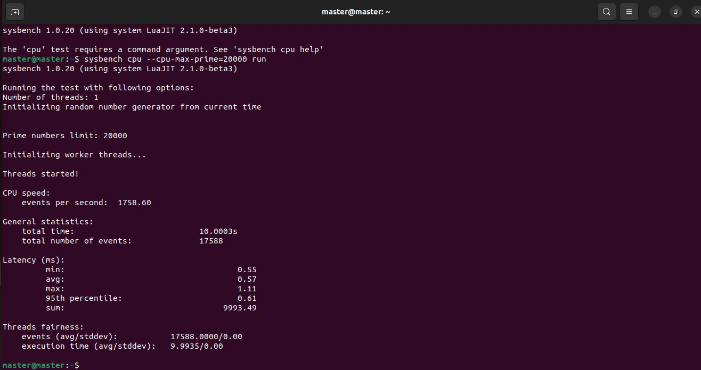

# Performance Analysis of Type-1 and Type-2 Hypervisors

## 1. Problem Statement

Virtual machines can be hosted using different hypervisor architectures. A Type-1 hypervisor runs directly on physical hardware, whereas a Type-2 hypervisor runs above a host operating system.

This experiment studies and compares the performance of a virtual machine running on:

* **Type-1 Hypervisor:** Proxmox VE
* **Type-2 Hypervisor:** VMware Workstation

Both virtual machines use Ubuntu with comparable virtual hardware resources. The same CPU benchmark is executed in both environments to observe the effect of the hypervisor architecture on performance.

---

## 2. Objectives

1. To understand the architecture and working principles of Type-1 and Type-2 hypervisors.
2. To create and configure an Ubuntu virtual machine using Proxmox VE and VMware Workstation.
3. To verify CPU, memory, storage, network, and operating-system configurations in both environments.
4. To measure virtual machine CPU performance using the Sysbench benchmark.
5. To compare the measured performance of Type-1 and Type-2 hypervisors using execution time, throughput, and latency.

---

# 3. Type-1 Hypervisor — Proxmox VE

## 3.1 Configuration

| Parameter              | Type-1 Configuration |
| ---------------------- | -------------------- |
| Hypervisor             | Proxmox VE           |
| Hypervisor Type        | Type-1               |
| Guest Operating System | Ubuntu               |
| CPU                    | 1 socket × 2 cores   |
| Total vCPU             | 2                    |
| Memory                 | 2048 MiB (2 GB)      |
| Virtual Disk           | 20 GB                |
| Network                | vmbr0                |
| Network Model          | VirtIO / default     |
| CPU Benchmark          | Sysbench             |

The Type-1 virtual machine is configured with 2 vCPU, 2 GB RAM, and a 20 GB virtual disk as specified in the experiment setup.

---

## 3.2 Architecture

A Type-1 hypervisor runs directly on the physical hardware without a conventional host operating-system layer.

```text
Physical Hardware
       |
       v
+---------------------------+
|       Proxmox VE          |
|      Type-1 Hypervisor    |
+-------------+-------------+
              |
              v
+---------------------------+
|         Ubuntu VM         |
|                           |
|  2 vCPU                   |
|  2 GB RAM                 |
|  20 GB Virtual Disk       |
|  vmbr0 Network            |
+---------------------------+
```

In this experiment, Proxmox VE provides the virtualization layer and hosts the Ubuntu virtual machine.

---

## 3.3 Execution Steps

### Step 1: Access Proxmox VE

Open the Proxmox management interface in a web browser:

```text
https://<PROXMOX_SERVER_IP>:8006
```

Log in using the assigned credentials.

### Step 2: Create the Virtual Machine

Create a new virtual machine and configure:

```text
Guest OS   → Ubuntu
CPU        → 2 vCPU
Memory     → 2 GB
Disk       → 20 GB
Network    → vmbr0
```

### Step 3: Start and Install Ubuntu

Start the VM and complete the Ubuntu installation.

### Step 4: Verify the Configuration

Inside the Ubuntu VM:

```bash
hostnamectl
lscpu
free -h
df -h
```

These commands are used to verify the operating system, CPU, memory, and storage configuration.

### Step 5: Monitor Resources

Monitor the virtual machine using:

```bash
top
```

Proxmox can also be used to observe CPU, memory, disk, and network utilization.

### Step 6: Install Sysbench

```bash
sudo apt update
sudo apt install sysbench -y
```

Verify:

```bash
sysbench --version
```

### Step 7: Run the CPU Benchmark

```bash
sysbench cpu --cpu-max-prime=20000 run
```

Record:

```text
Total Execution Time
Total Events
Events per Second
Latency
```

The same Sysbench workload is used for both Type-1 and Type-2 so that the results can be compared.

---

## 3.4 Final Result

The following screenshot shows the final Sysbench result obtained from the Type-1 virtual machine.


### Type-1 Result

| Metric               |      Result |
| -------------------- | ----------: |
| Hypervisor           |  Proxmox VE |
| Hypervisor Type      |      Type-1 |
| Guest OS             |      Ubuntu |
| CPU                  |      2 vCPU |
| Memory               |        2 GB |
| Disk                 |       20 GB |
| Total Execution Time | **14.52 s** |
| Total Events         |  **10,000** |
| Events per Second    |  **688.42** |
| Average Latency      | **2.90 ms** |

These are the Type-1 values currently recorded in the repository README.

---

# 4. Type-2 Hypervisor — VMware Workstation

## 4.1 Configuration

| Parameter              | Type-2 Configuration  |
| ---------------------- | --------------------- |
| Hypervisor             | VMware Workstation    |
| Hypervisor Type        | Type-2                |
| Host Operating System  | Windows               |
| Guest Operating System | Ubuntu                |
| CPU                    | 1 processor × 2 cores |
| Total vCPU             | 2                     |
| Memory                 | 2048 MB (2 GB)        |
| Virtual Disk           | 20 GB                 |
| Network                | NAT                   |
| CPU Benchmark          | Sysbench              |

The Type-2 virtual machine uses the same basic CPU, memory, and disk allocation as the Type-1 VM, while the network configuration is NAT.

---

## 4.2 Architecture

A Type-2 hypervisor runs on top of a host operating system.

```text
Physical Hardware
       |
       v
+---------------------------+
|      Host OS: Windows     |
+-------------+-------------+
              |
              v
+---------------------------+
|    VMware Workstation     |
|      Type-2 Hypervisor    |
+-------------+-------------+
              |
              v
+---------------------------+
|         Ubuntu VM         |
|                           |
|  2 vCPU                   |
|  2 GB RAM                 |
|  20 GB Virtual Disk       |
|  NAT Network              |
+---------------------------+
```

VMware Workstation therefore introduces the host operating-system layer between the physical hardware and the hypervisor.

---

## 4.3 Execution Steps

### Step 1: Launch VMware Workstation

Open VMware Workstation and select:

```text
Create a New Virtual Machine
```

### Step 2: Select the VM Configuration

Choose:

```text
Typical (recommended)
```

### Step 3: Select the Ubuntu ISO

Select the Ubuntu installation ISO.

### Step 4: Configure the Virtual Machine

Configure:

```text
Guest OS   → Ubuntu 64-bit
CPU        → 2 vCPU
Memory     → 2 GB
Disk       → 20 GB
Network    → NAT
```

### Step 5: Start and Install Ubuntu

Power on the VM and complete the Ubuntu installation.

### Step 6: Verify the Configuration

Inside Ubuntu:

```bash
hostnamectl
lscpu
free -h
df -h
```

### Step 7: Monitor Resources

Use:

```bash
top
```

The VMware Workstation settings can also be checked to verify processor, memory, disk, and network configuration.

### Step 8: Install Sysbench

```bash
sudo apt update
sudo apt install sysbench -y
```

Verify:

```bash
sysbench --version
```

### Step 9: Run the CPU Benchmark

```bash
sysbench cpu --cpu-max-prime=20000 run
```

Record the same performance metrics used for Type-1.

---

## 4.4 Final Result

The following screenshot shows the final Sysbench result obtained from the Type-2 virtual machine.



### Type-2 Result

| Metric               |             Result |
| -------------------- | -----------------: |
| Hypervisor           | VMware Workstation |
| Hypervisor Type      |             Type-2 |
| Guest OS             |             Ubuntu |
| CPU                  |             2 vCPU |
| Memory               |               2 GB |
| Disk                 |              20 GB |
| Network              |                NAT |
| Total Execution Time |      **10.0004 s** |
| Total Events         |        **333,929** |
| Events per Second    |      **33,381.54** |
| Minimum Latency      |        **0.01 ms** |
| Average Latency      |        **0.03 ms** |
| Maximum Latency      |        **5.54 ms** |

These are the Type-2 values currently recorded in the repository README.

---

# 5. Performance Analysis

The performance comparison is based on the Sysbench CPU benchmark executed inside the Ubuntu virtual machines.

Both VMs use:

```text
CPU       → 2 vCPU
Memory    → 2 GB
Disk      → 20 GB
Guest OS  → Ubuntu
Benchmark → Sysbench CPU
```

The main architectural difference is:

```text
Type-1
Physical Hardware
        |
        v
   Proxmox VE
        |
        v
    Ubuntu VM


Type-2
Physical Hardware
        |
        v
   Windows Host OS
        |
        v
 VMware Workstation
        |
        v
    Ubuntu VM
```

---

## 5.3 Performance Difference and Comparison Table

| Performance Metric   | Type-1: Proxmox VE | Type-2: VMware Workstation |           Difference | Observation                      |
| -------------------- | -----------------: | -------------------------: | -------------------: | -------------------------------- |
| Total Execution Time |            14.52 s |                  10.0004 s |   **4.5196 s lower** | Type-2 is faster                 |
| Total Events         |             10,000 |                    333,929 |   **323,929 higher** | Type-2 completed more events     |
| Events per Second    |             688.42 |                  33,381.54 | **32,693.12 higher** | Type-2 has higher throughput     |
| Average Latency      |            2.90 ms |                    0.03 ms |    **2.87 ms lower** | Type-2 has lower latency         |
| Maximum Latency      |            8.50 ms |                    5.54 ms |    **2.96 ms lower** | Type-2 has lower maximum latency |

### Percentage Difference

| Metric            |         Percentage Difference |
| ----------------- | ----------------------------: |
| Execution Time    |    **31.13% lower in Type-2** |
| Events per Second | **4749.10% higher in Type-2** |
| Average Latency   |    **98.97% lower in Type-2** |

The recorded results show that the Type-2 configuration performed better for the selected benchmark run in terms of execution time, throughput, and latency.

---

## 5.3 Performance Graph


The graph provides a visual comparison of the measured CPU benchmark performance between the two hypervisor environments.

---

# 7. Conclusion

This experiment provided a practical comparison of Type-1 and Type-2 hypervisor architectures using Ubuntu virtual machines and a common Sysbench CPU workload.

The Type-1 environment was implemented using Proxmox VE, while the Type-2 environment was implemented using VMware Workstation. Both virtual machines were configured with 2 vCPU, 2 GB RAM, and 20 GB of virtual disk space.

The recorded benchmark results showed that, for this particular experimental run, the VMware Workstation Type-2 environment produced a lower execution time, higher events per second, and lower latency than the Proxmox VE Type-1 environment. However, the results represent the specific laboratory setup and system conditions under which the benchmarks were executed.

The experiment therefore demonstrates that hypervisor architecture can influence virtual-machine performance and that meaningful comparison requires controlled configurations, consistent workloads, and measurements taken from the actual experimental environment.

---

# 8. Author

**Name:** Zakiya Tahasildar

